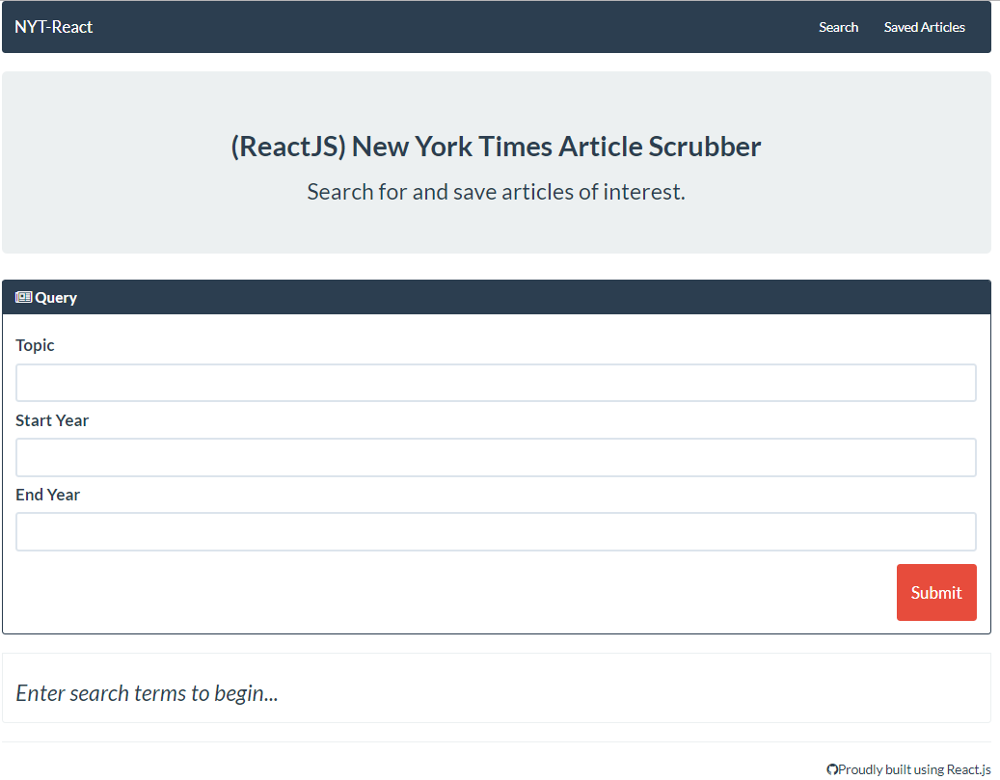

# NYT-React
Welcome to the New York Times Article Search web application. This app is a Mongo DB and React JS powered search tool that uses React components and helper functions to query a database and display articles. 

In addition to article search, users can also save and delete articles at their choosing.

For Deployed Project <a href="https://nyt-react-kv.herokuapp.com/"> Click Here</a>

</img>